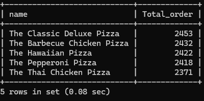

# 🍕 Pizza Sales SQL Analysis

This project involves a comprehensive analysis of a pizza sales dataset using SQL. The dataset includes information about orders, pizzas, pizza types, and order details. The goal is to extract meaningful business insights such as total revenue, order patterns, popular pizza types, and more.

## 📁 Database Setup

```sql
CREATE DATABASE Pizza_sales;
```

---

## 📊 Analysis Queries

### 1. Total Number of Orders
Counts the total number of orders placed.
```sql
SELECT COUNT(order_id) AS Total_orders FROM orders;
```


### 2. Total Revenue Generated
Calculates the total revenue from pizza sales.
```sql
SELECT ROUND(SUM(od.quantity * p.price), 2) AS Total_revenue
FROM order_details AS od
JOIN pizzas AS p ON od.pizza_id = p.pizza_id;
```


### 3. Highest Priced Pizza
Identifies the pizza with the highest price.
```sql
SELECT pt.name, p.price AS Highest_Price
FROM pizza_types AS pt
JOIN pizzas AS p ON pt.pizza_type_id = p.pizza_type_id
ORDER BY p.price DESC
LIMIT 1;
```


### 4. Most Common Pizza Size Ordered
Finds the most frequently ordered pizza size.
```sql
SELECT p.size, COUNT(od.order_id) AS Total_order
FROM pizzas AS p
JOIN order_details AS od ON p.pizza_id = od.pizza_id
GROUP BY size
ORDER BY Total_order DESC;
```


### 5. Top 5 Most Ordered Pizza Types
Displays the top 5 pizzas by quantity ordered.
```sql
SELECT pt.name, SUM(od.quantity) AS Total_order
FROM pizza_types AS pt
JOIN pizzas AS p ON pt.pizza_type_id = p.pizza_type_id
JOIN order_details AS od ON od.pizza_id = p.pizza_id
GROUP BY pt.name
ORDER BY Total_order DESC
LIMIT 5;
```


### 6. Total Quantity by Pizza Category
Aggregates the quantity ordered per pizza category.
```sql
SELECT pt.category, SUM(od.quantity) AS Total_quantity
FROM pizza_types AS pt
JOIN pizzas AS p ON pt.pizza_type_id = p.pizza_type_id
JOIN order_details AS od ON od.pizza_id = p.pizza_id
GROUP BY pt.category
ORDER BY Total_quantity DESC;
```


### 7. Order Distribution by Hour
Analyzes the number of orders by each hour of the day.
```sql
SELECT HOUR(order_time) AS Hour, COUNT(order_id) AS Total_order
FROM orders
GROUP BY HOUR(order_time);
```


### 8. Category-wise Pizza Distribution
Counts how many pizzas are in each category.
```sql
SELECT category, COUNT(name)
FROM pizza_types
GROUP BY category;
```


### 9. Average Number of Pizzas Ordered Per Day
Uses a CTE to calculate average pizzas ordered daily.
```sql
WITH Quantity_Orders AS (
    SELECT o.order_date, SUM(od.quantity) AS total_quantity
    FROM orders AS o 
    JOIN order_details AS od ON o.order_id = od.order_id
    GROUP BY o.order_date
)
SELECT ROUND(AVG(total_quantity), 0) AS avg_quantity_per_day FROM Quantity_Orders;
```


### 10. Top 3 Pizza Types by Revenue
Finds top-selling pizzas based on revenue.
```sql
SELECT pt.name, SUM(od.quantity * p.price) AS Total_revenue
FROM pizza_types AS pt
JOIN pizzas AS p ON p.pizza_type_id = pt.pizza_type_id
JOIN order_details AS od ON od.pizza_id = p.pizza_id
GROUP BY pt.name
ORDER BY Total_revenue DESC
LIMIT 3;
```


### 11. Revenue Contribution by Pizza Category
Calculates the percentage of revenue contributed by each category.
```sql
WITH CategoryRevenue AS (
    SELECT pt.category, ROUND(SUM(od.quantity * p.price), 2) AS total_revenue
    FROM pizza_types AS pt
    JOIN pizzas AS p ON pt.pizza_type_id = p.pizza_type_id
    JOIN order_details AS od ON p.pizza_id = od.pizza_id
    GROUP BY pt.category
)
SELECT category, total_revenue,
       ROUND((total_revenue / SUM(total_revenue) OVER ()) * 100, 2) AS revenue_percentage
FROM CategoryRevenue
ORDER BY total_revenue DESC;
```


### 12. Cumulative Revenue Over Time
Tracks revenue growth over time using a cumulative sum.
```sql
WITH DailyRevenue AS (
    SELECT o.order_date, ROUND(SUM(od.quantity * p.price), 2) AS daily_revenue
    FROM orders AS o
    JOIN order_details AS od ON o.order_id = od.order_id
    JOIN pizzas AS p ON od.pizza_id = p.pizza_id
    GROUP BY o.order_date
)
SELECT order_date, daily_revenue,
       ROUND(SUM(daily_revenue) OVER (ORDER BY order_date), 2) AS cumulative_revenue
FROM DailyRevenue
ORDER BY order_date;
```


### 13. Top 3 Pizzas by Revenue per Category
Ranks pizzas within each category by revenue and selects the top 3.
```sql
WITH PizzaRevenue AS (
    SELECT pt.category, pt.name, SUM(od.quantity * p.price) AS revenue
    FROM pizza_types AS pt
    JOIN pizzas AS p ON pt.pizza_type_id = p.pizza_type_id
    JOIN order_details AS od ON od.pizza_id = p.pizza_id
    GROUP BY pt.category, pt.name
),
RankedPizzaRevenue AS (
    SELECT category, name, revenue,
           RANK() OVER (PARTITION BY category ORDER BY revenue DESC) AS rn
    FROM PizzaRevenue
)
SELECT category, name, revenue
FROM RankedPizzaRevenue
WHERE rn <= 3
ORDER BY category, rn;
```


---

## 📌 Summary

This SQL analysis offers valuable insights into pizza sales performance, popular products, and revenue trends. By examining data across various dimensions like time, size, and category, business stakeholders can make data-driven decisions to improve marketing strategies, optimize inventory, and enhance customer satisfaction.

---

📈 **Key Takeaways:**
- The Thai Chiken Pizza dominates revenue generation.
- Larged-sized pizzas are the most ordered.
- Afternoons and evenings show peak order activity.
- Supreme and Veggie categories have the highest product variety.